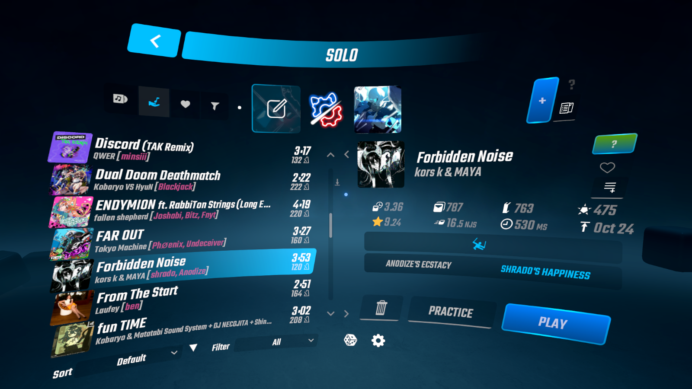

# Better Song List
*This is a modified version of the upstream version of Better Song List, please see [Kinsi's repo](https://github.com/kinsi55/BeatSaber_BetterSongList) for the official version. Modifications include:*
- Minor UI formatting fanciness (oo la la)
- Display of the map's jump distance in reaction time (milliseconds), instead of raw JD
  - (kudos to iPixelGalaxy! I used their RT formula in their version)
- Absolute map age, instead of relative map age
- ~~stuff to get the compiler to stop giving me yellow triangles shut up!!!!! shut up!!!~~

*I'm messing around with this in order to learn a bit more about modding, this is really only intended for myself. If you want changes made to the mod, I'd recommend submitting a feature request to the official repo, not mine.*

---

### Dependencies

- BSML
- SongCore
- *(Optional)* SongDetailsCache

---

